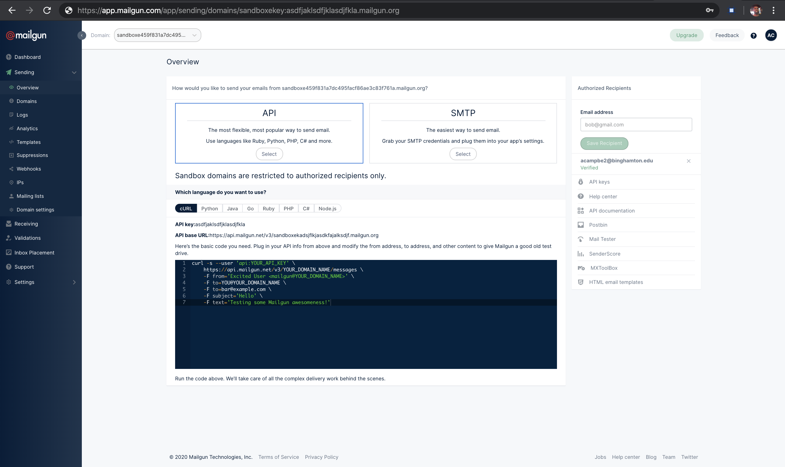
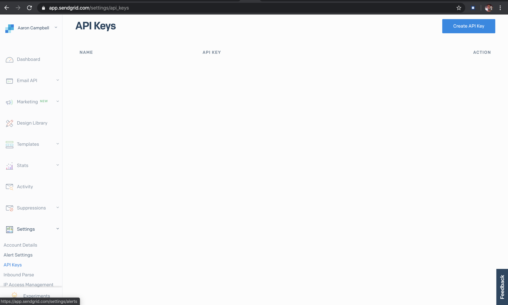

# Email Middleman

This service is an abstraction between two email service providers(MailGun & SendGrid). Simply change a env variable/restart app and failover to a different provider

## Getting Started

1. Install Docker :

        On mac go to: 'https://docs.docker.com/docker-for-mac/install/'

2. Sign Up for SendGrid and MailGun
        Sendgrid: https://app.sendgrid.com/
        MailGun: https://www.mailgun.com/

3. In MailGun:
        Once Signed Up with Mailgun click on the Sending Tab followed by the Overview tab.
        In the overview Tab click on API box. You will need to copy and save the apikey and API base URL fields for later.
        

        If you're using the free version of mailgun you'll need to whitelist the email addresses you want to send
        and email to. In the image above I've verified that the only email address that can receive emails via
        MailGun acampbe2@binghamton.edu

4. In SendGrid:
        click on the Settings tab followed by API Keys tab. Create a new API Key via the API KEY button.
        You'll need to save the api key for later.
        

5. Create a .env to store all your environmental variables. You'll need the following below.  

        MAILGUN_DOMAIN_NAME = "API base URL field"
        MAILGUN_APIKEY="apikey key"
        SENDGRID_PASSWORD="Your sendgrid API key"

        Both the mail_gun_api_service & send_grid_api_service use the .env variables for sending http request

6. Switching between MailGun and SendGrid  
        This app uses the [Flipper Active Record Adapter](https://github.com/jnunemaker/flipper/tree/master/docs/active_record) for feature toggling. You'll need to create the     
        default_mailer feature flag in the console as so:

        Flipper Active Record Adapter Setup:
        ````
        rails g flipper:active_record
        docker-compose run web rake db:migrate
        ````

Enabling Feature flag:
````Ruby
  adapter = Flipper::Adapters::ActiveRecord.new
  flipper = Flipper.new(adapter)
  flipper[:default_mailer].enable
````
Disabling Feature flag:
````Ruby
  flipper = Flipper::Adapters::ActiveRecord::Gate.find_by(feature_key: "default_mailer", key: "boolean")
  flipper.update! value: "false"
````

7. You'll need to build the web app docker image
        Run the following once: docker-compose build
        Now whenever you want to run the app: docker-compose up

## Tools/Migrations
1. For running Rspec run: docker-compose run web rspec
2. For checking routes: docker-compose run web rake routes
3. For running migrations: docker-compose run web rails g migration etc

### Prerequisites
Docker
SendGrid and MailGun Sign up

##Code Snippet:
  - In the emails_controller.rb file the send_mail contains the logic for deciding between email services.
````Ruby
def default_mailer_enabled?
  flipper_gate = Flipper::Adapters::ActiveRecord::Gate.find_by(feature_key: "default_mailer", key: "boolean")
  return false if flipper_gate.nil?
  flipper_gate.value == "true"
end

def send_mail
  data = bundle_payload(email_params)
  if default_mailer_enabled?
    MailGunApiService.new(data).send_email
  else
    SendGridApiService.new(data).send_email
  end
end
````

### Email Middleman in Action


## Built With

* [MailGun](https://www.mailgun.com/)
* [SendGrid](https://sendgrid.com/)
* [Docker](https://docs.docker.com/docker-for-mac/install/) - Containers for an easy setup


If I were to do this again I'd choose a more light weight frame work like Tornado. I believe rails was a little overkill for this project, but it was the frame work I knew the best. Additionally, I'd probably want to store the emails on postgres in
case there was a network level, so I can resend the email at a later time. That being said, I'd also probably want some sort of
job running in the background to check if an email was correct sent. If an email failed to send this job would resend the email.
I'd also want to support multiple receivers, because as of right now only one person can receive an email.   

## Authors

* **Aaron Campbell**
