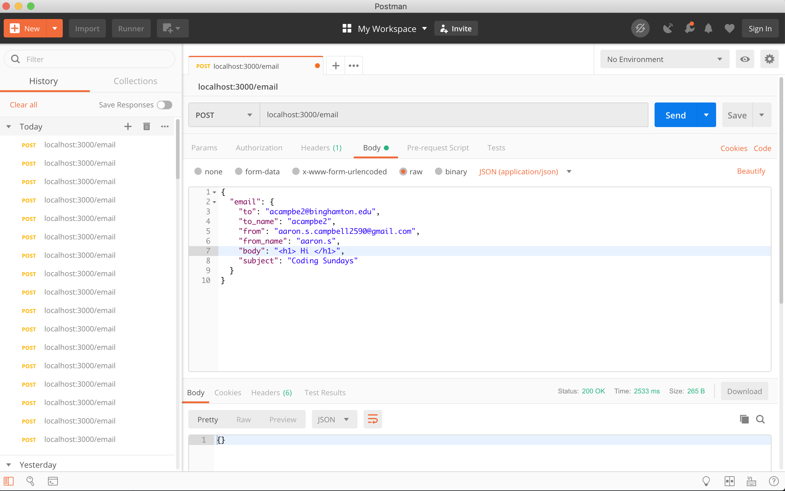

# Email Middleman

This service is an abstraction between two email service providers(MailGun & SendGrid). Simply change a configuration/restart app
and failover to a differ provider

## Getting Started

1. Install Docker :

        On mac go to: 'https://docs.docker.com/docker-for-mac/install/'

2. Sign Up for SendGrid and MailGun
        Sendgrid: https://app.sendgrid.com/
        MailGun: https://www.mailgun.com/

3. In MailGun:
        Once Signed Up with Mailgun click on the Sending Tab followed by the Overview tab.
        In the overview Tab click on SMTP box. You will need to copy and save the username and password fields for later.
        

        If you're using the free version of mailgun you'll need to whitlist the email addresses you want to send
        and email to. In the image above I've verified that the only email address that can receive emails via
        MailGun acampbe2@binghamton.edu
        

4. In SendGrid:
        In Sendgrid click on the Settings tab followed by API Keys tab. Create a new API Key via the API KEY button.
        You'll need to save the api key for later.

5. Create a .env to store all your environmental variables. You'll need the following below.

        DOMAIN="localhost:3000"
        DEFAULT_MAILER_ENABLED=true
        MAILGUN_USERNAME="Your mailgun username"
        MAILGUN_PASSWORD="Your mailgun password"
        SENDGRID_USERNAME="apikey" #everyone has the same username
        SENDGRID_PASSWORD="Your sendgrid API key"

6. Switching between MailGun and SendGrid  
        If you want to use MailGun in your .env set the DEFAULT_MAILER_ENABLED
        DEFAULT_MAILER_ENABLED=true
        If you want to use SendGrid comment out the DEFAULT_MAILER_ENABLED
        #DEFAULT_MAILER_ENABLED=true

7. You'll need to build the web app docker image
        Run the following once: docker-compose build
        Now whenever you want to run the app: docker-compose up

## Tools/Migrations
1. For running Rspec run: docker-compose run web rspec
2. For checking routes: docker-compose run web rake routes
3. For running migrations: docker-compose run web rails g migration etc

### Prerequisites
Docker
SendGrid and MailGun Sign up

##Code Snippet:
  - In the develop.rb file this is the logic for toggling between email services.
````Ruby

if ENV['DEFAULT_MAILER_ENABLED']
  config.action_mailer.smtp_settings = {
    :authentication => :plain,
    :address => "smtp.mailgun.org",
    :port => 587,
    :domain => ENV['DOMAIN'],
    :user_name => ENV['MAILGUN_USERNAME'],
    :password => ENV['MAILGUN_PASSWORD']
  }
else
  config.action_mailer.smtp_settings = {
    :authentication => :plain,
    :address => "smtp.sendgrid.net",
    :port => 587,
    :domain => ENV['DOMAIN'],
    :user_name => ENV['SENDGRID_USERNAME'],
    :password => ENV['SENDGRID_PASSWORD'],
  }
end
````

### Email Middleman in Action




## Built With

* [MailGun](https://www.mailgun.com/)
* [SendGrid](https://sendgrid.com/)
* [Docker](https://docs.docker.com/docker-for-mac/install/) - Containers for an easy setup


## Authors

* **Aaron Campbell**
